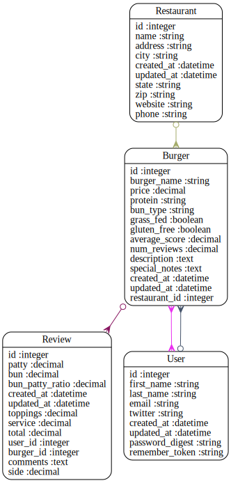

Code Review for dave_k
================================================
Project: project-1
================================================
#URLS

* HEROKU: https://burgerbuddy.herokuapp.com/
* GITHUB: https://github.com/daveyk535/project-1

# Summary

A nicely conceived burger rating application

I was able to register and review a burger on heroku


#Review Rubric

##Implementation Expecations

* Models & Data Relationships
	* Expectation: At least 2 related models
	* Review: ++Four models with several relationships
* Handles Invalid Data
	*  Expectation: Rails model validation for presence of necessary fields
	* Review:__TODO__
* Views & Templates	
	*  Expectation: Form partial used, but other duplication still exists
	* Review:__TODO__
* Authentication
	*  Expectation: Appropriate helper methods defined
	* Review:__TODO__
* Authorization
	* Expectation: Authorization scheme is well-thought out and used correctly.
	* Review:__TODO__
* API
	*  Expectation: An API call was made.
	* Review:__TODO__
* Testing
	*  Expectation: Includes request specs.
	* Review:__TODO__
* Heroku
	*  Expectation: Project is hosted on Heroku
	* Review: https://burgerbuddy.herokuapp.com/
* JavaScript/jQuery
	* Expectation: JS/jQuery is used to handle at least one interactive event after the window loads
	* Review:__TODO__

##Code Quality Expectations

* Test Driven
	* Expectation: In addition to models, requests have been tested for valid 	responses and valid data
	* Review:__TODO__
* Flexible / extensible / scalable
	* Expectation: No database calls inside a loop
	* Review:__TODO__
* Well-commented
	* Expectation: Comments are not sporadic. Comments address the "why".
	* Review:__TODO__
* Well-formatted, Clean Project
	* Expectation: No mix of tabs and spaces
	* Review:__TODO__
* Follows naming conventions
	* Expectation: Naming follows best practices (semantic variable naming)
	* Review:__TODO__
* Secure
	* Expectation: Authorization is implemented as well as authentication.  Athorization is achieved through controller methods or helpers that limit resources
	* Review:__TODO__
* Documenting Work
	* Expectation: Public presentation of work involving key aspects of development process
	* Review:__TODO__
	


#Your Gemfile

```
source 'https://rubygems.org'

# Bundle edge Rails instead: gem 'rails', github: 'rails/rails'
gem 'rails', '4.0.4'

gem 'bootstrap-sass', '2.3.2.0'
gem 'sprockets', '2.11.0'

# Use PostGres as the DB
gem 'pg'

gem 'yelpster'

gem 'yelp', require: 'yelp'

gem 'typhoeus'

#Use bcrypt for password hash
gem 'bcrypt-ruby','3.1.2'

# Use SCSS for stylesheets
gem 'sass-rails', '~> 4.0.2'

# Use Uglifier as compressor for JavaScript assets
gem 'uglifier', '>= 1.3.0'

# Use CoffeeScript for .js.coffee assets and views
gem 'coffee-rails', '~> 4.0.0'

# See https://github.com/sstephenson/execjs#readme for more supported runtimes
# gem 'therubyracer', platforms: :ruby

# Use jquery as the JavaScript library
gem 'jquery-rails'

# Turbolinks makes following links in your web application faster. Read more: https://github.com/rails/turbolinks
gem 'turbolinks'

# Build JSON APIs with ease. Read more: https://github.com/rails/jbuilder
gem 'jbuilder', '~> 1.2'

group :doc do
  # bundle exec rake doc:rails generates the API under doc/api.
  gem 'sdoc', require: false
end

group :development, :test do
  gem 'dotenv-rails'
  gem 'pry'
  gem 'rspec-rails'
  gem 'factory_girl_rails'
  gem 'capybara'
  gem 'spring'
  gem 'quiet_assets'
  gem 'better_errors'
  gem 'binding_of_caller'
  gem 'meta_request'
  gem 'awesome_print'
  gem 'pry-rails'
  gem 'pry-byebug'
  gem 'foreman'
end

group :production do
  gem 'rails_12factor'
end

# Use ActiveModel has_secure_password
# gem 'bcrypt', '~> 3.1.7'

# Use unicorn as the app server
# gem 'unicorn'

# Use Capistrano for deployment
# gem 'capistrano', group: :development

# Use debugger
# gem 'debugger', group: [:development, :test]

```


#Your Schema

```
# encoding: UTF-8
# This file is auto-generated from the current state of the database. Instead
# of editing this file, please use the migrations feature of Active Record to
# incrementally modify your database, and then regenerate this schema definition.
#
# Note that this schema.rb definition is the authoritative source for your
# database schema. If you need to create the application database on another
# system, you should be using db:schema:load, not running all the migrations
# from scratch. The latter is a flawed and unsustainable approach (the more migrations
# you'll amass, the slower it'll run and the greater likelihood for issues).
#
# It's strongly recommended that you check this file into your version control system.

ActiveRecord::Schema.define(version: 20140507010218) do

  # These are extensions that must be enabled in order to support this database
  enable_extension "plpgsql"

  create_table "burgers", force: true do |t|
    t.string   "burger_name"
    t.decimal  "price"
    t.string   "protein"
    t.string   "bun_type"
    t.boolean  "grass_fed"
    t.boolean  "gluten_free"
    t.decimal  "average_score"
    t.decimal  "num_reviews"
    t.text     "description"
    t.text     "special_notes"
    t.datetime "created_at"
    t.datetime "updated_at"
    t.integer  "restaurant_id"
  end

  create_table "restaurants", force: true do |t|
    t.string   "name"
    t.string   "address"
    t.string   "city"
    t.datetime "created_at"
    t.datetime "updated_at"
    t.string   "state"
    t.string   "zip"
    t.string   "website"
    t.string   "phone"
  end

  create_table "reviews", force: true do |t|
    t.decimal  "patty"
    t.decimal  "bun"
    t.decimal  "bun_patty_ratio"
    t.datetime "created_at"
    t.datetime "updated_at"
    t.decimal  "toppings"
    t.decimal  "service"
    t.decimal  "total"
    t.integer  "user_id"
    t.integer  "burger_id"
    t.text     "comments"
    t.decimal  "side"
  end

  create_table "users", force: true do |t|
    t.string   "first_name"
    t.string   "last_name"
    t.string   "email"
    t.string   "twitter"
    t.datetime "created_at"
    t.datetime "updated_at"
    t.string   "password_digest"
    t.string   "remember_token"
  end

  add_index "users", ["email"], name: "index_users_on_email", unique: true, using: :btree
  add_index "users", ["remember_token"], name: "index_users_on_remember_token", using: :btree

end

```


#Your Schema Diagram





#Your Rspec Results

```

User
  should have a first name

UserPages
  signup
    with invalid information
      should not create a user
    with valid information
      should create a user (FAILED - 1)

BurgerPages
  gets a success response from the home page

Failures:

  1) UserPages signup with valid information should create a user
     Failure/Error: fill_in "First Name",   with: "Example First"
     Capybara::ElementNotFound:
       Unable to find field "First Name"
     # ./spec/features/user_pages_spec.rb:20:in `block (4 levels) in <top (required)>'

Finished in 2.47 seconds
4 examples, 1 failure

Failed examples:

rspec ./spec/features/user_pages_spec.rb:28 # UserPages signup with valid information should create a user

Randomized with seed 55276


```


#Automated Best Practices Review Results

```


Source Codes: |=========================================================================================|
/work/ga/wdi/2014/march/project1/dave_k/db/schema.rb:19 - always add db index (burgers => [restaurant_id])
/work/ga/wdi/2014/march/project1/dave_k/db/schema.rb:47 - always add db index (reviews => [user_id])
/work/ga/wdi/2014/march/project1/dave_k/db/schema.rb:47 - always add db index (reviews => [burger_id])
/work/ga/wdi/2014/march/project1/dave_k/app/views/burgers/index.html.erb:23 - law of demeter
/work/ga/wdi/2014/march/project1/dave_k/app/views/burgers/show.html.erb:4 - law of demeter
/work/ga/wdi/2014/march/project1/dave_k/app/views/burgers/show.html.erb:16 - law of demeter
/work/ga/wdi/2014/march/project1/dave_k/app/helpers/burgers_helper.rb:1 - remove empty helpers
/work/ga/wdi/2014/march/project1/dave_k/app/helpers/restaurants_helper.rb:1 - remove empty helpers
/work/ga/wdi/2014/march/project1/dave_k/app/helpers/reviews_helper.rb:1 - remove empty helpers
/work/ga/wdi/2014/march/project1/dave_k/app/controllers/restaurants_controller.rb:28 - remove unused methods (RestaurantsController#restaurant_params)
/work/ga/wdi/2014/march/project1/dave_k/app/helpers/sessions_helper.rb:2 - remove unused methods (SessionsHelper#sign_in)
/work/ga/wdi/2014/march/project1/dave_k/app/helpers/sessions_helper.rb:9 - remove unused methods (SessionsHelper#sign_out)
/work/ga/wdi/2014/march/project1/dave_k/app/helpers/sessions_helper.rb:20 - remove unused methods (SessionsHelper#current_user=)
/work/ga/wdi/2014/march/project1/dave_k/app/views/shared/_error_messages.html.erb:1 - replace instance variable with local variable
/work/ga/wdi/2014/march/project1/dave_k/app/views/shared/_error_messages.html.erb:4 - replace instance variable with local variable
/work/ga/wdi/2014/march/project1/dave_k/app/views/shared/_error_messages.html.erb:7 - replace instance variable with local variable
/work/ga/wdi/2014/march/project1/dave_k/config/routes.rb:2 - restrict auto-generated routes users (except: [:destroy, :index])
/work/ga/wdi/2014/march/project1/dave_k/config/routes.rb:4 - restrict auto-generated routes reviews (only: [:show, :new, :create])
/work/ga/wdi/2014/march/project1/dave_k/config/routes.rb:5 - restrict auto-generated routes restaurants (except: [:edit, :update, :destroy])
/work/ga/wdi/2014/march/project1/dave_k/config/routes.rb:6 - restrict auto-generated routes burgers (only: [:show, :new, :index])
/work/ga/wdi/2014/march/project1/dave_k/app/controllers/burgers_controller.rb:2 - remove trailing whitespace
/work/ga/wdi/2014/march/project1/dave_k/app/controllers/restaurants_controller.rb:11 - remove trailing whitespace
/work/ga/wdi/2014/march/project1/dave_k/app/controllers/reviews_controller.rb:9 - remove trailing whitespace
/work/ga/wdi/2014/march/project1/dave_k/app/controllers/users_controller.rb:2 - remove trailing whitespace
/work/ga/wdi/2014/march/project1/dave_k/config/environments/production.rb:4 - remove trailing whitespace
/work/ga/wdi/2014/march/project1/dave_k/config/routes.rb:9 - remove trailing whitespace
/work/ga/wdi/2014/march/project1/dave_k/db/seeds.rb:13 - remove trailing whitespace
/work/ga/wdi/2014/march/project1/dave_k/app/views/burgers/index.html.erb:13 - remove trailing whitespace
/work/ga/wdi/2014/march/project1/dave_k/app/views/burgers/show.html.erb:12 - remove trailing whitespace
/work/ga/wdi/2014/march/project1/dave_k/app/views/restaurants/search.html.erb:1 - remove trailing whitespace
/work/ga/wdi/2014/march/project1/dave_k/app/views/reviews/new.html.erb:25 - remove trailing whitespace

Please go to http://rails-bestpractices.com to see more useful Rails Best Practices.

Found 31 warnings.

```


#Automated Code Review Results

```
Inspecting 29 files
CCCCCCCCCCCCCCCC...C..CCCCCCC

Offenses:

app/controllers/application_controller.rb:1:1: C: Missing top-level class documentation comment.
class ApplicationController < ActionController::Base
^^^^^
app/controllers/burgers_controller.rb:1:1: C: Missing top-level class documentation comment.
class BurgersController < ApplicationController
^^^^^
app/controllers/burgers_controller.rb:2:1: C: Trailing whitespace detected.
app/controllers/burgers_controller.rb:10:11: C: Trailing whitespace detected.
  def show 
          ^
app/controllers/burgers_controller.rb:13:1: C: Extra empty line detected at body end.
app/controllers/burgers_controller.rb:15:1: C: 1 trailing blank lines detected.
app/controllers/restaurants_controller.rb:1:1: C: Missing top-level class documentation comment.
class RestaurantsController < ApplicationController
^^^^^
app/controllers/restaurants_controller.rb:2:1: C: Extra empty line detected at body beginning.
app/controllers/restaurants_controller.rb:11:11: C: Trailing whitespace detected.
  def show 
          ^
app/controllers/restaurants_controller.rb:17:78: C: Trailing whitespace detected.
    @restaurant.update(name: params[:name], city: params[:restaurant][:city]) 
                                                                             ^
app/controllers/restaurants_controller.rb:27:3: C: Keep a blank line before and after private.
  private
  ^^^^^^^
app/controllers/restaurants_controller.rb:28:5: C: Inconsistent indentation detected.
    def restaurant_params
    ^^^^^^^^^^^^^^^^^^^^^
app/controllers/restaurants_controller.rb:29:48: C: Missing space after #.
      params.require(:restaurant).permit(:name)#, :address, :city, :state, :zip, :website, :phone)
                                               ^^^^^^^^^^^^^^^^^^^^^^^^^^^^^^^^^^^^^^^^^^^^^^^^^^^
app/controllers/restaurants_controller.rb:29:80: C: Line is too long. [98/79]
      params.require(:restaurant).permit(:name)#, :address, :city, :state, :zip, :website, :phone)
                                                                               ^^^^^^^^^^^^^^^^^^^
app/controllers/restaurants_controller.rb:31:1: C: Extra empty line detected at body end.
app/controllers/restaurants_controller.rb:34:1: C: Extra blank line detected.
app/controllers/restaurants_controller.rb:37:80: C: Line is too long. [81/79]
# [6] pry(#<RestaurantsController>)> @response.businesses[0].location.postal_code
                                                                               ^^
app/controllers/restaurants_controller.rb:41:80: C: Line is too long. [80/79]
# [8] pry(#<RestaurantsController>)> @response.businesses[0].location.address[0]
                                                                               ^
app/controllers/restaurants_controller.rb:43:80: C: Line is too long. [80/79]
# [9] pry(#<RestaurantsController>)> @response.businesses[0].location.state_code
                                                                               ^
app/controllers/reviews_controller.rb:1:1: C: Missing top-level class documentation comment.
class ReviewsController < ApplicationController
^^^^^
app/controllers/reviews_controller.rb:2:1: C: Extra empty line detected at body beginning.
app/controllers/reviews_controller.rb:9:11: C: Trailing whitespace detected.
  def show 
          ^
app/controllers/reviews_controller.rb:13:13: C: Trailing whitespace detected.
  def create 
            ^
app/controllers/reviews_controller.rb:19:1: C: Extra empty line detected at body end.
app/controllers/reviews_controller.rb:22:1: C: Keep a blank line before and after private.
private
^^^^^^^
app/controllers/reviews_controller.rb:23:5: C: Inconsistent indentation detected.
    def review_params
    ^^^^^^^^^^^^^^^^^
app/controllers/reviews_controller.rb:24:80: C: Line is too long. [115/79]
      params.require(:review).permit(:patty, :bun, :bun_patty_ratio, :toppings, :service, :side, :total, :comments)
                                                                               ^^^^^^^^^^^^^^^^^^^^^^^^^^^^^^^^^^^^
app/controllers/sessions_controller.rb:1:1: C: Missing top-level class documentation comment.
class SessionsController < ApplicationController
^^^^^
app/controllers/sessions_controller.rb:2:1: C: Extra empty line detected at body beginning.
app/controllers/sessions_controller.rb:21:1: C: Extra empty line detected at body end.
app/controllers/users_controller.rb:1:1: C: Missing top-level class documentation comment.
class UsersController < ApplicationController
^^^^^
app/controllers/users_controller.rb:2:1: C: Trailing whitespace detected.
app/controllers/users_controller.rb:3:11: C: Trailing whitespace detected.
  def show 
          ^
app/controllers/users_controller.rb:15:25: C: Prefer single-quoted strings when you don't need string interpolation or special symbols.
      flash[:success] = "Welcome to BurgerBuddy!"
                        ^^^^^^^^^^^^^^^^^^^^^^^^^
app/controllers/users_controller.rb:18:23: C: Prefer single-quoted strings when you don't need string interpolation or special symbols.
      flash[:error] = "Failed to create account.  Try again."
                      ^^^^^^^^^^^^^^^^^^^^^^^^^^^^^^^^^^^^^^^
app/controllers/users_controller.rb:32:1: C: Extra empty line detected at body end.
app/controllers/users_controller.rb:35:1: C: Extra blank line detected.
app/controllers/users_controller.rb:36:1: C: Keep a blank line before and after private.
private
^^^^^^^
app/controllers/users_controller.rb:37:5: C: Inconsistent indentation detected.
    def user_params
    ^^^^^^^^^^^^^^^
app/controllers/users_controller.rb:38:80: C: Line is too long. [112/79]
      params.require(:user).permit(:first_name, :last_name, :email, :twitter, :password, :password_confirmation)
                                                                               ^^^^^^^^^^^^^^^^^^^^^^^^^^^^^^^^^
app/helpers/application_helper.rb:1:1: C: Missing top-level module documentation comment.
module ApplicationHelper
^^^^^^
app/helpers/burgers_helper.rb:1:1: C: Missing top-level module documentation comment.
module BurgersHelper
^^^^^^
app/helpers/restaurants_helper.rb:1:1: C: Missing top-level module documentation comment.
module RestaurantsHelper
^^^^^^
app/helpers/reviews_helper.rb:1:1: C: Missing top-level module documentation comment.
module ReviewsHelper
^^^^^^
app/helpers/sessions_helper.rb:1:1: C: Missing top-level module documentation comment.
module SessionsHelper
^^^^^^
app/helpers/sessions_helper.rb:20:3: C: Use attr_writer to define trivial writer methods.
  def current_user=(user)
  ^^^
app/helpers/users_helper.rb:1:1: C: Missing top-level module documentation comment.
module UsersHelper
^^^^^^
app/helpers/users_helper.rb:4:30: C: Do not use :: for method calls.
    gravatar_id = Digest::MD5::hexdigest(user.email.downcase)
                             ^^
app/helpers/users_helper.rb:6:58: C: Prefer single-quoted strings when you don't need string interpolation or special symbols.
    image_tag(gravatar_url, alt: user.first_name, class: "gravatar")
                                                         ^^^^^^^^^^
app/models/burger.rb:1:1: C: Missing top-level class documentation comment.
class Burger < ActiveRecord::Base
^^^^^
app/models/restaurant.rb:1:1: C: Missing top-level class documentation comment.
class Restaurant < ActiveRecord::Base
^^^^^
app/models/review.rb:1:1: C: Missing top-level class documentation comment.
class Review < ActiveRecord::Base
^^^^^
app/models/user.rb:1:1: C: Missing top-level class documentation comment.
class User < ActiveRecord::Base
^^^^^
app/models/user.rb:7:80: C: Line is too long. [110/79]
  validates :email, presence: true, format: { with: VALID_EMAIL_REGEX }, uniqueness: { case_sensitive: false }
                                                                               ^^^^^^^^^^^^^^^^^^^^^^^^^^^^^^^
app/models/user.rb:11:7: C: Use self.new_remember_token instead of User.new_remember_token.
  def User.new_remember_token
      ^^^^
app/models/user.rb:15:7: C: Use self.digest instead of User.digest.
  def User.digest(token)
      ^^^^
app/models/user.rb:18:1: C: Extra empty line detected at body end.
app/models/user.rb:21:3: C: Keep a blank line before and after private.
  private
  ^^^^^^^
app/models/user.rb:22:5: C: Inconsistent indentation detected.
    def create_remember_token
    ^^^^^^^^^^^^^^^^^^^^^^^^^
app/models/user.rb:25:1: C: 2 trailing blank lines detected.
Rakefile:2:80: C: Line is too long. [90/79]
# for example lib/tasks/capistrano.rake, and they will automatically be available to Rake.
                                                                               ^^^^^^^^^^^
spec/features/burger_pages_spec.rb:3:10: C: Prefer single-quoted strings when you don't need string interpolation or special symbols.
describe "BurgerPages" do
         ^^^^^^^^^^^^^
spec/features/burger_pages_spec.rb:8:4: C: Final newline missing.
end
   
spec/features/user_pages_spec.rb:3:10: C: Prefer single-quoted strings when you don't need string interpolation or special symbols.
describe "UserPages" do
         ^^^^^^^^^^^
spec/features/user_pages_spec.rb:4:1: C: Use 2 (not 0) spaces for indentation.
subject { page }

spec/features/user_pages_spec.rb:6:3: C: Inconsistent indentation detected.
  describe "signup" do
  ^^^^^^^^^^^^^^^^^^^^
spec/features/user_pages_spec.rb:6:12: C: Prefer single-quoted strings when you don't need string interpolation or special symbols.
  describe "signup" do
           ^^^^^^^^
spec/features/user_pages_spec.rb:10:20: C: Prefer single-quoted strings when you don't need string interpolation or special symbols.
    let(:submit) { "Create my account" }
                   ^^^^^^^^^^^^^^^^^^^
spec/features/user_pages_spec.rb:12:14: C: Prefer single-quoted strings when you don't need string interpolation or special symbols.
    describe "with invalid information" do
             ^^^^^^^^^^^^^^^^^^^^^^^^^^
spec/features/user_pages_spec.rb:13:10: C: Prefer single-quoted strings when you don't need string interpolation or special symbols.
      it "should not create a user" do
         ^^^^^^^^^^^^^^^^^^^^^^^^^^
spec/features/user_pages_spec.rb:18:14: C: Prefer single-quoted strings when you don't need string interpolation or special symbols.
    describe "with valid information" do
             ^^^^^^^^^^^^^^^^^^^^^^^^
spec/features/user_pages_spec.rb:20:17: C: Prefer single-quoted strings when you don't need string interpolation or special symbols.
        fill_in "First Name",   with: "Example First"
                ^^^^^^^^^^^^
spec/features/user_pages_spec.rb:20:39: C: Prefer single-quoted strings when you don't need string interpolation or special symbols.
        fill_in "First Name",   with: "Example First"
                                      ^^^^^^^^^^^^^^^
spec/features/user_pages_spec.rb:21:17: C: Prefer single-quoted strings when you don't need string interpolation or special symbols.
        fill_in "Last Name",    with: "Example Last"
                ^^^^^^^^^^^
spec/features/user_pages_spec.rb:21:39: C: Prefer single-quoted strings when you don't need string interpolation or special symbols.
        fill_in "Last Name",    with: "Example Last"
                                      ^^^^^^^^^^^^^^
spec/features/user_pages_spec.rb:22:17: C: Prefer single-quoted strings when you don't need string interpolation or special symbols.
        fill_in "Email",        with: "user@example.com"
                ^^^^^^^
spec/features/user_pages_spec.rb:22:39: C: Prefer single-quoted strings when you don't need string interpolation or special symbols.
        fill_in "Email",        with: "user@example.com"
                                      ^^^^^^^^^^^^^^^^^^
spec/features/user_pages_spec.rb:23:17: C: Prefer single-quoted strings when you don't need string interpolation or special symbols.
        fill_in "Twitter",      with: "tweetboy"
                ^^^^^^^^^
spec/features/user_pages_spec.rb:23:39: C: Prefer single-quoted strings when you don't need string interpolation or special symbols.
        fill_in "Twitter",      with: "tweetboy"
                                      ^^^^^^^^^^
spec/features/user_pages_spec.rb:24:17: C: Prefer single-quoted strings when you don't need string interpolation or special symbols.
        fill_in "Password",     with: "foobar"
                ^^^^^^^^^^
spec/features/user_pages_spec.rb:24:39: C: Prefer single-quoted strings when you don't need string interpolation or special symbols.
        fill_in "Password",     with: "foobar"
                                      ^^^^^^^^
spec/features/user_pages_spec.rb:25:17: C: Prefer single-quoted strings when you don't need string interpolation or special symbols.
        fill_in "Confirmation", with: "foobar"
                ^^^^^^^^^^^^^^
spec/features/user_pages_spec.rb:25:39: C: Prefer single-quoted strings when you don't need string interpolation or special symbols.
        fill_in "Confirmation", with: "foobar"
                                      ^^^^^^^^
spec/features/user_pages_spec.rb:28:10: C: Prefer single-quoted strings when you don't need string interpolation or special symbols.
      it "should create a user" do
         ^^^^^^^^^^^^^^^^^^^^^^
spec/features/user_pages_spec.rb:35:1: C: Missing space after #.
#7.1.3 factory girl
^^^^^^^^^^^^^^^^^^^
spec/features/user_pages_spec.rb:35:20: C: Final newline missing.
#7.1.3 factory girl
                   
spec/helpers/restaurants_helper_spec.rb:14:1: C: Trailing whitespace detected.
spec/helpers/reviews_helper_spec.rb:14:1: C: Trailing whitespace detected.
spec/models/burger_spec.rb:4:1: C: Trailing whitespace detected.
spec/models/user_spec.rb:3:1: C: Extra blank line detected.
spec/models/user_spec.rb:4:3: C: Inconsistent indentation detected.
  describe 'User' do
  ^^^^^^^^^^^^^^^^^^
spec/models/user_spec.rb:8:7: C: Missing space after #.
      #expect(@user).to be_valid
      ^^^^^^^^^^^^^^^^^^^^^^^^^^
spec/models/user_spec.rb:16:1: C: Missing space after #.
#test e-mail presence, format, uniqueness incuding case-sensitivity (FactoryGirl, cook_cook_with auth)
^^^^^^^^^^^^^^^^^^^^^^^^^^^^^^^^^^^^^^^^^^^^^^^^^^^^^^^^^^^^^^^^^^^^^^^^^^^^^^^^^^^^^^^^^^^^^^^^^^^^^^
spec/models/user_spec.rb:16:80: C: Line is too long. [102/79]
#test e-mail presence, format, uniqueness incuding case-sensitivity (FactoryGirl, cook_cook_with auth)
                                                                               ^^^^^^^^^^^^^^^^^^^^^^^
spec/models/user_spec.rb:18:1: C: Missing space after #.
#test password_digest, password and password_confirmation for presence and password mismatch (Listing 6.25)
^^^^^^^^^^^^^^^^^^^^^^^^^^^^^^^^^^^^^^^^^^^^^^^^^^^^^^^^^^^^^^^^^^^^^^^^^^^^^^^^^^^^^^^^^^^^^^^^^^^^^^^^^^^
spec/models/user_spec.rb:18:80: C: Line is too long. [107/79]
#test password_digest, password and password_confirmation for presence and password mismatch (Listing 6.25)
                                                                               ^^^^^^^^^^^^^^^^^^^^^^^^^^^^
spec/models/user_spec.rb:19:1: C: Missing space after #.
#test password length (6 chars)
^^^^^^^^^^^^^^^^^^^^^^^^^^^^^^^
spec/models/user_spec.rb:20:1: C: Missing space after #.
#test for length (too short and too long)
^^^^^^^^^^^^^^^^^^^^^^^^^^^^^^^^^^^^^^^^^
spec/models/user_spec.rb:22:1: C: Missing space after #.
#rails generate migration add_index_to_users_email
^^^^^^^^^^^^^^^^^^^^^^^^^^^^^^^^^^^^^^^^^^^^^^^^^^
spec/spec_helper.rb:2:5: C: Prefer single-quoted strings when you don't need string interpolation or special symbols.
ENV["RAILS_ENV"] ||= 'test'
    ^^^^^^^^^^^
spec/spec_helper.rb:3:26: C: Prefer single-quoted strings when you don't need string interpolation or special symbols.
require File.expand_path("../../config/environment", __FILE__)
                         ^^^^^^^^^^^^^^^^^^^^^^^^^^
spec/spec_helper.rb:9:21: C: Prefer single-quoted strings when you don't need string interpolation or special symbols.
Dir[Rails.root.join("spec/support/**/*.rb")].each { |f| require f }
                    ^^^^^^^^^^^^^^^^^^^^^^
spec/spec_helper.rb:41:18: C: Prefer single-quoted strings when you don't need string interpolation or special symbols.
  config.order = "random"
                 ^^^^^^^^

29 files inspected, 103 offenses detected

```

